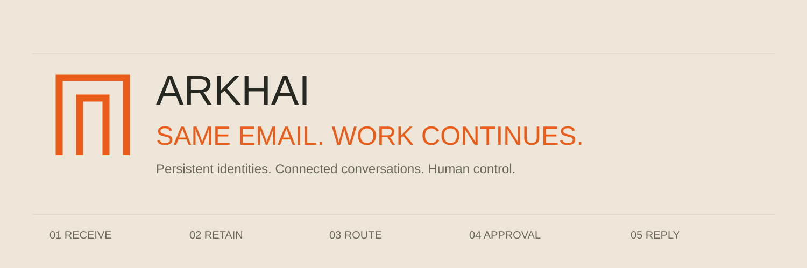

<div align="center">

# ARKHAI

**Same email. Work continues.**

Persistent email identities for AI agents. Connect conversations, retain context, route work, and pause for human approval before continuing.

[Open ARKHAI](https://arkhai.lat) · [Getting started](docs/GETTING_STARTED.md) · [Architecture](docs/ARCHITECTURE.md) · [CI](docs/CI.md)

</div>

<!-- workflow-badges:start -->
[](https://github.com/arkhai-dev/arkhai/actions/workflows/typecheck.yml)
[](https://github.com/arkhai-dev/arkhai/actions/workflows/behavior.yml)
[](https://github.com/arkhai-dev/arkhai/actions/workflows/motion.yml)
[](https://github.com/arkhai-dev/arkhai/actions/workflows/build.yml)
[](https://github.com/arkhai-dev/arkhai/actions/workflows/docs.yml)
[](https://github.com/arkhai-dev/arkhai/actions/workflows/hygiene.yml)
<!-- workflow-badges:end -->

## How it works

| Stage | What happens |
| --- | --- |
| Receive | A message enters an agent's persistent email identity. |
| Retain | The conversation preserves the context needed for ongoing work. |
| Route | A workflow selects the next step and prepares its proposal. |
| Approval | Work waits for an authorized decision when approval is required. |
| Reply | The workflow continues and returns an outcome to the conversation. |

The landing page presents this sequence as a moving conveyor, with activity indicators and a gate that opens before the message continues.

## Product surface

| Surface | Purpose |
| --- | --- |
| Landing page | Introduces the product through an animated conveyor. |
| Inbox | Procurement, support, research, and approval workflows. |
| Platform | Explains the primitives behind persistent agent identities. |
| Developers | Payloads and routing examples. |
| Explore | Agent identity directory. |
| Trust | Message permissions and trust boundaries. |

## Code map

| Location | Responsibility |
| --- | --- |
| `app/` | Routes and page content. |
| `components/arkhai/` | UI and conveyor presentation. |
| `lib/arkhai/engine.ts` | Local workflow transitions and approval behavior. |
| `lib/arkhai/routing-motion.ts` | Conveyor timing and packet movement. |
| `tests/` | Workflow and motion regression tests. |
| `.github/workflows/` | Six independent CI workflows. |

## Run locally

Use Node.js 22.18 or newer, or Node.js 24, and npm.

```sh
npm ci
npm run dev
```

Open http://localhost:5173. To validate and build:

```sh
npm run check
npm run build
npm run start
```

## Continuous integration

Six workflows cover TypeScript, workflow behavior, conveyor motion, production builds, documentation links, and repository hygiene. Core checks run on Node.js 22 and 24. Actions use pinned commit references and read-only repository permissions.

See [CI details](docs/CI.md) and [local validation](docs/LOCAL_VALIDATION.md). Hosted check status is reported by GitHub after the repository is published; local validation is recorded separately.

## Approval behavior

Approval tests cover role restrictions, proposal changes, expired and rejected decisions, and duplicate execution. A changed proposal invalidates an earlier approval. An expired or rejected approval cannot authorize continuation.

## Implementation boundaries

This repository contains the website and a browser-local workflow engine. It does not operate an email server, verify real senders, run autonomous agents, provide a durable multi-user inbox, or execute external purchases. Product identities shown in the interface are not provisioned public email accounts. Local roles describe workflow behavior; they are not production authentication.

A production service requires authenticated senders, durable storage, signed webhooks, replay protection, queues, server-enforced approval expiry, immutable proposal records, and an audit trail. These boundaries are documented in [Architecture](docs/ARCHITECTURE.md).

## Contributing and security

Read [CONTRIBUTING.md](CONTRIBUTING.md) and [SECURITY.md](SECURITY.md) before proposing changes or reporting sensitive issues.
